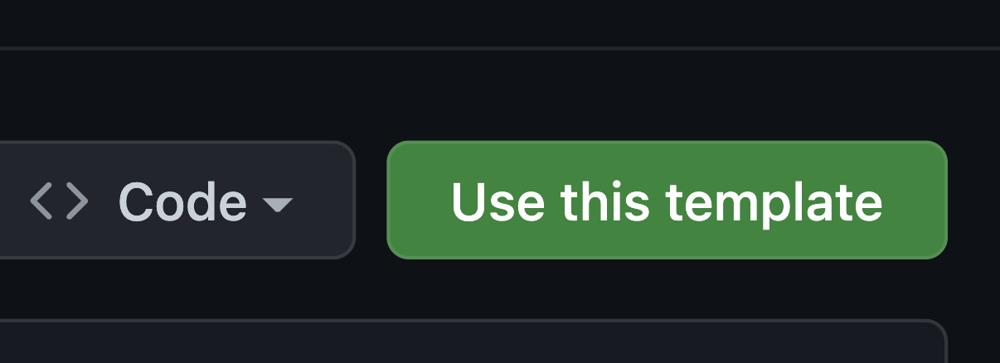

# Nextstart

Welcome to my frontend template.

- Give me kodos by adding a star! ⭐
- Click `Use this template` on the top right to get started. Or just press the image below.

[](https://github.com/junhoyeo/nextstart/generate)

You can either go CLI:

```bash
# 1. Clone this repo
git clone https://github.com/junhoyeo/nextstart projectName
cd projectName

# 2. Initialize `git`
rm -rf .git
rm -rf docs/images
rm README.md

git init
git commit -m "Initialize project" -m "From template https://github.com/junhoyeo/nextstart"
code README.md
```
